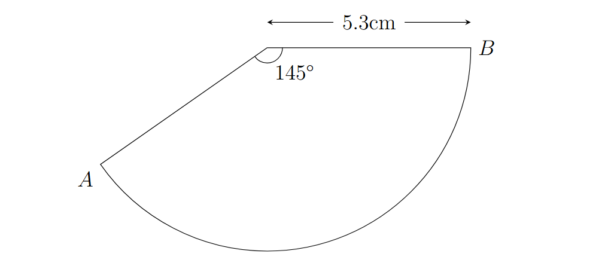
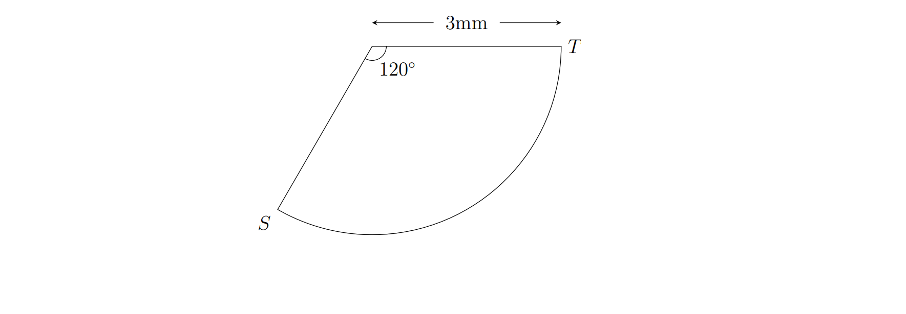
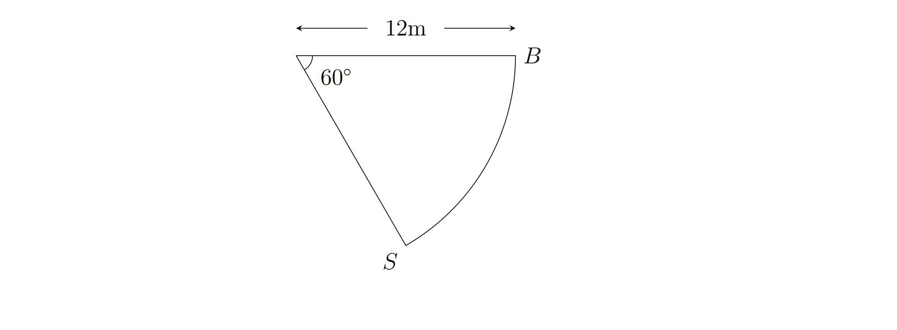
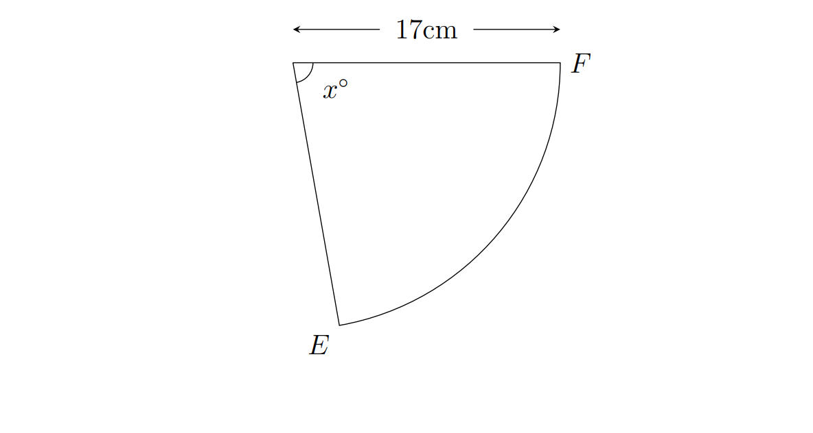
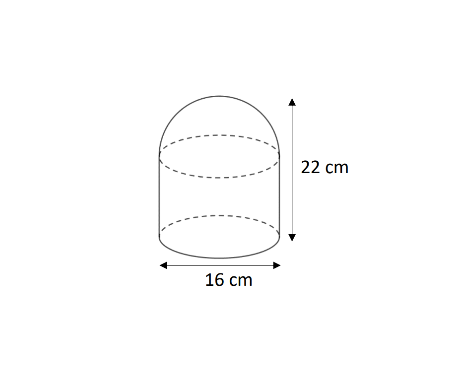
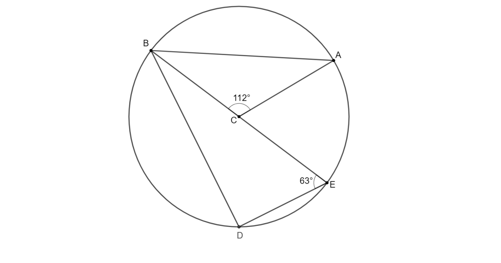
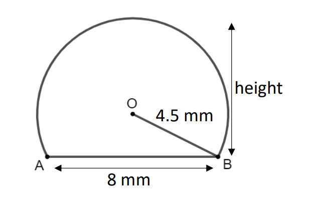
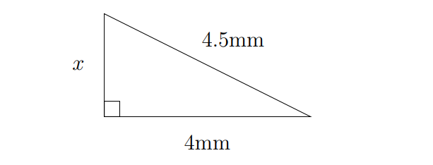
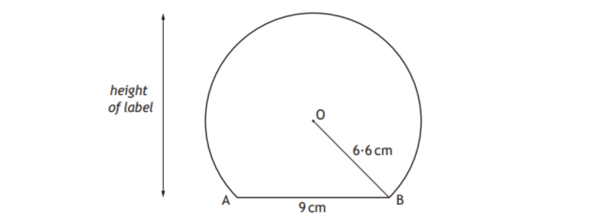
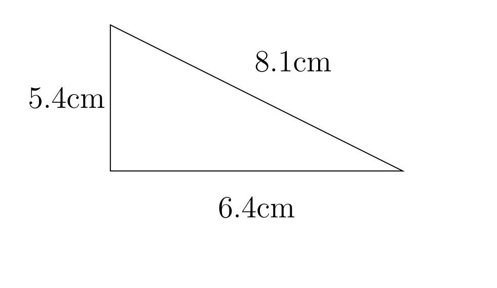

```{r setup, include = FALSE}
knitr::opts_chunk$set(echo = FALSE)
library(webexercises)
```


```{r, echo = FALSE, results='asis'}
# Uncomment to change widget colours:
#style_widgets(incorrect = "goldenrod", correct = "purple")
```

For each topic/skill, notes and examples are given followed by some questions for you to try. Enter your answers into the self-marking spaces provided to see if you got them correct. If you aren't sure where you went wrong, **ask for help!**

If you would like to practice more questions of that type, use the revision questions shared through Teams/OneNote.

## 1 - Rounding To Significance Figures

When rounding numbers to significant figures, key things to remember are that:

- If the **next** number **after** the required number of significant figures is 5 or more then the last digit should be rounded *up*. Otherwise it should remain the *same*.

e.g. $196100$ rounded to **2sf** $\rightarrow \underline{19}|\mathbf{6}100\rightarrow200000$

- Zeroes at the *front*, found in small numbers, **don't count** as significant figures. This means that in the number 0.0040237 the first three significant figures are 4, 0 and 2. The zeroes at the front are *placeholders* and should still be there in your answer.

e.g. $0.00504217$ rounded to **3sf** $\rightarrow0.00\underline{504}|\mathbf{2}17\rightarrow0.00504$

- When rounding large numbers you may end up with several zeros after the significant figures, such as 863702.17 becoming 864000.00. To complete this rounding (to 3 significant figures) the **placeholder** zeroes to the **left** of the decimal point must remain, whilst those to the **right** of the decimal place should be discarded. The final answer should then be 864000

e.g. $79261.39$ rounding to **3sf** $\rightarrow \underline{792}|\mathbf{6}1.39\rightarrow79300$

- If you are asked to round to three significant figures and the number itself contains at least three digits then you **must not shorten it to less than three digits**. This mistake usually happens when the last of the significant digits is or becomes a *zero*.

e.g. $72.9715$ rounded to **3sf** $\rightarrow \underline{72.9}|\mathbf{7}15\rightarrow73.0$ and **not** $73$.

::: {.webex-check .webex-box}

#### Questions

**(a)** The number 48730 rounded to *two significant figures* is: `r fitb(49000)`

**(b)** The number 0.0030814 rounded to *three significant figures* is: `r fitb(0.00308)`

**(c)** The number 4528.71 rounded to *three significant figures* is: `r fitb(4530)`

:::

## 2 - Simplifying Surds

To simplify surds, you must become familiar with **square numbers**, which are the numbers produced by multiplying whole numbers by themselves. The first three numbers are $1,4,9\dots$ since $1\times 1=\mathbf{1},\quad 2\times 2=\mathbf{4}\quad,3\times 3=\mathbf{9}\dots$ and so on. The first twelve square numbers are:

$$1,4,9,16,25,36,49,64,81,100,121,144$$

To simplify a surd, split it into **two square roots** multiplied together, with the **first** being the **largest square number that it can be divided by**, and the second being whoever many times it goes into it. 

The **first, square number** can then be square rooted.

e.g. Below, recognise that the square number **9** is a factor

$$\begin{aligned}
&\sqrt{18}\\[1em]
=&\sqrt{\mathbf{9}}\sqrt{2}\\[1em]
=&3\sqrt{2}
\end{aligned}$$

If there are several square numbers that go into it, make sure you take the time to find the **largest**.

e.g. Below, recognise that 4 **and** 16 are square factors. **Use 16**.

$$\begin{aligned}
&\sqrt{48}\\[1em]
=&\sqrt{\mathbf{16}}\sqrt{3}\\[1em]
=&4\sqrt{3}
\end{aligned}$$

e.g. If the surd is already multiplied by an integer, remember to finish with a multiplication.

$$\begin{aligned}
&4\sqrt{125}\\[1em]
=&4\sqrt{\mathbf{25}}\sqrt{5}\\[1em]
=&4\times 5\sqrt{5}\\[1em]
=&20\sqrt{5}\\[1em]
\end{aligned}$$

A surd has been fully simplified when there are no further square factors (apart from 1).

::: {.webex-check .webex-box}

#### Questions

**(a)** $\sqrt{24}$ can be simplified to: `r fitb(2)`$\sqrt{}$`r fitb(6)`

**(b)** $\sqrt{500}$ can be simplified to: `r fitb(10)`$\sqrt{}$`r fitb(5)`

**(c)** $7\sqrt{72}$ can be simplified to: `r fitb(42)`$\sqrt{}$`r fitb(2)`

:::

## 3 - Collecting Surds

Surds can be collected, as long as they are the *same* surd. For example, $4\sqrt{\mathbf{7}}+2\sqrt{\mathbf{7}}$ can be *collected* as $6\sqrt{\mathbf{7}}$. However $4\sqrt{\mathbf{7}}+2\sqrt{\mathbf{5}}$ **cannot** be collected.

A common National 5 question requires surds to be *simplified* then *collected*.

e.g. Simplify $\sqrt{80}-2\sqrt{45}+7\sqrt{5}$

$$\begin{aligned}
&\sqrt{80}&-&&2\sqrt{45}&&+&&7\sqrt{5}\\[1em]
=\quad&\sqrt{16}\sqrt{5}&-&&2\sqrt{9}\sqrt{5}&&+&&7\sqrt{5}\\[1em]
=\quad&4\sqrt{5}&-&&6\sqrt{5}&&+&&7\sqrt{5}\\[1em]
=\quad&5\sqrt{5}&&&&&
\end{aligned}$$

::: {.webex-check .webex-box}

#### Questions

**(a)** $\sqrt{98}-\sqrt{8}$ can be simplified to: `r fitb(5)`$\sqrt{}$`r fitb(2)`

**(b)** $\sqrt{40}+6\sqrt{10}$ can be simplified to: `r fitb(8)`$\sqrt{}$`r fitb(10)`

**(c)** $\sqrt{600}+\sqrt{24}-3\sqrt{150}$ can be simplified to: `r fitb(-3)`$\sqrt{}$`r fitb(6)`

:::

## 4 - Rationalising the Denominator

Surds are *irrational*, so the fraction $\dfrac{4}{\sqrt{5}}$ has an **irrational denominator**.

By multiplying the fraction by $\dfrac{\sqrt{5}}{\sqrt{5}}$ we can **rationalise the denominator**.

$$\dfrac{4}{\sqrt{5}}\times \dfrac{\sqrt{5}}{\sqrt{5}} = \dfrac{4\sqrt{5}}{5}$$

The steps in answering a question of this time fully are:

- Make the denominator rational through multiplication (e.g. $\times \dfrac{5}{5}$)

- Check if the **surd** can be *simplified*, and do so if it can. Above, $\sqrt{5}$ cannot be simplified.

- Check if the integer parts of the fraction can be simplified. Above, $\dfrac{4}{5}$ cannot be simplified.

e.g. Express $\dfrac{10}{\sqrt{6}}$ with a rational denominator.

$$\dfrac{10}{\sqrt{6}}\times \dfrac{\sqrt{6}}{\sqrt{6}}=\dfrac{10\sqrt{6}}{6}=\dfrac{5\sqrt{6}}{3}$$

e.g. Express $\dfrac{20}{\sqrt{8}}$ with a rational denominator.

$$\dfrac{20}{\sqrt{8}}\times \dfrac{\sqrt{8}}{\sqrt{8}}=\dfrac{20\sqrt{8}}{8}=\dfrac{20\times 2\sqrt{2}}{8}=\dfrac{40\sqrt{2}}{8}=\dfrac{5\sqrt{2}}{1}=5\sqrt{2}$$

Note that for the example above $\dfrac{5\sqrt{2}}{1}$ would not be accepted as a **final** answer.

::: {.webex-check .webex-box}

#### Questions

**(a)** $\dfrac{7}{\sqrt{3}}$ written with a rational denominator in its simplest form is: `r mcq(c("A",answer="B","C","D"))`

$$\text{A}:\quad\dfrac{\sqrt{7}}{3}\quad
\text{B}:\quad\dfrac{7\sqrt{3}}{3}\quad
\text{C}:\quad\dfrac{3\sqrt{7}}{3}\quad
\text{D}:\quad\dfrac{\sqrt{3}}{7}$$

**(b)** $\dfrac{30}{\sqrt{6}}$ written with a rational denominator in its simplest form is: `r mcq(c("A","B","C",answer="D"))`

$$\text{A}:\quad\dfrac{6\sqrt{30}}{6}\quad
\text{B}:\quad\dfrac{30\sqrt{6}}{6}\quad
\text{C}:\quad 6\sqrt{5}\quad
\text{D}:\quad 5\sqrt{6}$$

**(c)** $\dfrac{3}{\sqrt{12}}$ written with a rational denominator in its simplest form is: `r mcq(c("A","B",answer="C","D"))`

$$\text{A}:\quad\dfrac{3\sqrt{12}}{12}\quad
\text{B}:\quad\dfrac{\sqrt{12}}{4}\quad
\text{C}:\quad\dfrac{\sqrt{3}}{2}\quad
\text{D}:\quad\dfrac{\sqrt{3}}{6}$$

:::

## 5 - Indices

There are **three rules for indices** you should be familiar with:

- Multiplying powers: $x^m\times x^n=x^{m+n}$

- Dividing powers: $\dfrac{x^m}{x^n}=x^{m-n}$

- Powers of powers: $\left(x^m\right)^n=x^{m\times n}$

e.g. Simplify $\dfrac{4x^5\times2x^4}{10x^3}$

$$\dfrac{4x^5\times2x^4}{10x^3}=\dfrac{8x^9}{10x^3}=\cfrac{4}{5}x^6$$

e.g. Simplify $\dfrac{\left(2x^4\right)^3}{4x^5}$

$$\dfrac{\left(2x^4\right)^3}{4x^5}=\dfrac{8x^{12}}{4x^5}=2x^7$$

::: {.webex-check .webex-box}

#### Questions

**(a)** $\dfrac{6x^7\times 3x^4}{9x^8}$ can be written in the form $ax^b$. The value of $a$ is: `r fitb(2)` and the value of $b$ is: `r fitb(3)`.

**(b)** $\dfrac{\left(2x^3\right)^5}{8x^9}$ can be written in the form $ax^b$. The value of $a$ is: `r fitb(4)` and the value of $b$ is: `r fitb(6)`.

**(c)** $\dfrac{10x^3}{x^2\times 5x^{-4}}$ can be written in the form $ax^b$. The value of $a$ is: `r fitb(2)` and the value of $b$ is: `r fitb(5)`.

:::

## 6 - Scientific Notation

Numbers can be changed into scientific notation, or turned back into normal form, by counting the number of moves of the decimal point.

$457000\leftrightarrow 4.57\times10^5$

Small numbers (less than 1) should have a *negative* power.

$0.0000457 \leftrightarrow 4.57\times 10^{-5}$

Scientific notation questions in the N5 exam often consist of calculator questions in which the answer must be given in scientific notation.

e.g. A (very large!) circle has radius $7.1\times10^5$ centimetres. Calculate its area, giving your answer in standard form.

*(Note that Scientific Notation and Standard Form are the same thing)*

$$\text{Area}=\pi r^2=\pi \times \left(7.1\times 10^5\right)^2=1.58\times 10^{12}\text{ square centimetres}$$

If the calculator gives you an answer that is already in scientific notation, just write it down carefully.

::: {.webex-check .webex-box}

#### Questions

**(a)** A planet has a diameter of $8\times 10^6$ metres, whilst one of its moons has a diameter of has a diameter of $3.2\times 10^4$ metres. Determine how many times larger the diameter of the planet is than the diameter of the moon.

Answer: `r fitb(250)` times larger.

**(b)** Light travels at a speed of $3\times 10^8$ metres per second in a vacuum. Calculate how far light will travel in a minute, giving your answer in standard form.

Answer: `r fitb(1.8)`$\times 10$ to the power of `r fitb(10)` metres.

**(c)** An arc has central angle $140^{\circ}$ and a radius of $3.4\times 10^7$ metres. Find its length, giving your answer in scientific notation to *three significant figures*.

Answer: `r fitb(8.31)`$\times 10$ to the power of `r fitb(7)` metres.

:::

## 7 - Expanding Brackets

There are a number of ways of approaching multiplying out brackets. The most important points, whatever the method used, are to:

- Take care with powers of $x$ and dealing with negatives.

- Collect alike terms *carefully*.

e.g. Expand and simplify $(x+3)(x^2-4x+5)$

$$\begin{aligned}
&(x+3)(x^2-4x+5)\\[1em]
=&x(x^2-4x+5)+3(x^2-4x+5)\\[1em]
=&x^3-4x^2+5x+3x^2-12x+15\\[1em]
=&x^3-x^2-7x+15
\end{aligned}$$

Square brackets should be written twice before expanding.

e.g. Expand and simplify $(x-5)^2+4(x^2-8)$

$$\begin{aligned}
&(x-5)^2+4(x^2-8)\\[1em]
=&(x-5)(x-5)+4x^2-32\\[1em]
=&x(x-5)-5(x-5)+4x^2-32\\[1em]
=&x^2-5x-5x+25+4x^2-32\\[1em]
=&5x^2-10x-7
\end{aligned}$$

::: {.webex-check .webex-box}

#### Questions

**(a)** Expand and simplify $(5x+2)(x-3)+20x+7$.

If the answer is in the form $ax^2+bx+c$, state the values of $a$, $b$ and $c$.

$a=$`r fitb(5)`
$b=$`r fitb(7)`
$c=$`r fitb(1)`

**(b)** Expand and simplify $(2x+4)^2+3(2x^2-1)$.

If the answer is in the form $ax^2+bx+c$, state the values of $a$, $b$ and $c$.

$a=$`r fitb(10)`
$b=$`r fitb(16)`
$c=$`r fitb(13)`

**(c)** Expand and simplify $(x+2)(x^2+3x+1)$.

If the answer is in the form $ax^3+bx^2+cx+d$, state the values of $a$, $b$, $c$ and $d$.

$a=$`r fitb(1)`
$b=$`r fitb(5)`
$c=$`r fitb(7)`
$d=$`r fitb(2)`

:::

## 8 - Factorising

There are three factorising methods than you need to know in the N5 course, and it is recommended to look for each in order:

- **Common Factor**

e.g. Factorise $x^2-8x$

Answer: $x(x-8)$

- **Difference of Two Squares**

e.g. Factorise $x^2-16$

*(Note that* $16=4^2$*)*

Answer: $(x+4)(x-4)$

- **Quadratic Trinomials**

e.g. Factorise $x^2-5x-14$

*(Think of numbers that multiply to make *$-14$ *and add to make* $-5$*)*

Answer: $(x+2)(x-7)$

- **Combinations of methods**

Finally, it may be required to use common factor first and then another method.

e.g. Factorise $3x^2-12$ **fully**.

Answer: $3(x^2-4)\rightarrow 3(x+2)(x-2)$

::: {.webex-check .webex-box}

#### Questions

**(a)** Factorise $4x^2-10x$.

Answer: `r fitb("2x(2x-5)",ignore_case=TRUE)`

**(b)** Factorise $x^2-4x+3$.

Answer: `r fitb(c("(x-1)(x-3)","(x-3)(x-1)"),ignore_case=TRUE)`

**(c)** Factorise $5x^2-45$ fully.

Answer: `r fitb(c("5(x+3)(x-3)","5(x-3)(x+3)"),ignore_case=TRUE)`

:::

## 9 - Gradient Between Coordinates

The steepness of a slope is measured by its **gradient**, which is defined as:

$$\text{gradient}=\dfrac{\text{change in vertical}}{\text{change in horizontal}}$$

Given two coordinates $\left(x_1,y_1\right)$ and $\left(x_2,y_2\right)$, the gradient ($m$) of the straight line joining them can be found using the formula:

$$m=\dfrac{y_2-y_1}{x_2-x_1}$$

e.g. Determine the gradient of the line between points $(4,-3)$ and $(10,6)$.

*(First, label one coordinate as* $\left(x_1,y_1\right)$ *and the other as* $\left(x_2,y_2\right)$*)*

$$m=\dfrac{y_2-y_1}{x_2-x_1}=\dfrac{6-(-3)}{10-4}=\dfrac{9}{6}=\dfrac{3}{2}$$

Be careful dealing with any negatives, and simplify your answer if possible.


::: {.webex-check .webex-box}

#### Questions

**(a)** Determine the gradient of the line between points $(2,6)$ and $(4,14)$.

Answer: $m=$`r fitb(4)`

**(b)** Determine the gradient of the line between points $(4,2)$ and $(7,-4)$.

Answer: $m=$`r fitb(-2)`

**(c)** Determine the gradient of the line between points $(-2,-1)$ and $(3,4)$.

Answer: $m=$`r fitb(1)`

:::

## 10 - The Equation of a Straight Line

The equation of a straight line with a gradient of $m$ and which passes through the point $(0,c)$, called its $y$-*intercept*, is:

$$y=mx+c$$

e.g. State the equation of the line with a gradient of $-4$ which passes through the point $(0,7)$.

Since $m=-4$ and $c=7$:

$$y=-4x+7$$

When the gradient is known but the $y$-*intercept* is **not known**, and *another point* is known instead, a different equation may be more useful.

The equation of a straight line with gradient $m$ passing through the point $(a,b)$ is: 

$$y-b=m(x-a)$$

e.g. Determine the equation of the straight line with a gradient of $5$ which passes through the point $(2,3)$.

Since $m=5$ and a point $(a,b)$ is $(2,3)$:

$$\begin{aligned}
y-b&=m(x-a)\\[1em]
y-3&=5(x-2)\\[1em]
y-3&=5x-10\\[1em]
y&=5x-7
\end{aligned}$$

Note that when using this equation the brackets need to be expanded and numerical terms ($-3$ and $-10$) not left separately, dealt with here by adding $3$ to both sides of the equation.

If the gradient is not known but instead *two coordinates* are given, it will be necessary to first calculate the gradient in the same was as done in the last set of questions, before picking **either** of the two cooridnates as $(a,b)$ to use in the straight line equation.

e.g. Determine the equation of the line between points $(-2,8)$ and $(1,2)$.

$$m=\dfrac{y_2-y_1}{x_2-x_1}=\dfrac{2-8}{1-(-2)}=\dfrac{-6}{3}=-2$$

$$\begin{aligned}
y-b&=m(x-a)\\[1em]
y-2&=-2(x-1)\\[1em]
y-2&=-2x+2\\[1em]
y&=-2x+4
\end{aligned}$$

::: {.webex-check .webex-box}

#### Questions

**(a)** State the equation of the line with a gradient of $4$ passing through $(0,-2)$.

Answer: $m=$`r fitb("y=4x-2",ignore_case=TRUE)`

**(b)** Determine the equation of the line between points $(4,2)$ and $(7,-4)$.

Answer: $m=$`r fitb("y=-2x+10",ignore_case=TRUE)`

**(c)** Determine the equation of the line between points $(-2,-1)$ and $(3,4)$.

Answer: $m=$`r fitb("y=x+1",ignore_case=TRUE)`

:::

## 11 Calculating Arc Lengths

An **arc** is a **fraction of the circumference** of a circle, and so for an arc with central angle $x^{\circ}$ its length may be calculated using:

$$\text{Arc Length}=\dfrac{x^{\circ}}{360^{\circ}}\times\pi D$$

e.g. Calculate the length of an arc with a radius of 5.3 centimetres and a central angle of 145 degrees, as shown below:

:::: {style="display: grid; grid-template-columns: 1fr 1fr; grid-column-gap: 10px;"}

::: {}

:::

::: {}
$$\begin{aligned}
\text{Arc Length}&=\dfrac{x^{\circ}}{360^{\circ}}\times\pi D\\[1em]
&=\dfrac{145^{\circ}}{360^{\circ}}\times\pi \times 10.6\\[1em]
&=13.41\text{cm}
\end{aligned}$$
:::

::::

::: {.webex-check .webex-box}

#### Questions

**(a)** Find the length of the arc $PQ$, shown below, giving your answer correct to 3 significant figures.


Answer: `r fitb(8.92)`$\text{cm}$

**(b)** Find the length of the arc $ST$, shown below, taking $\pi=3.14$. **Non-Calculator**



Answer: `r fitb(6.28)`$\text{mm}$

**(c)** Find the length of the arc $AB$, shown below, giving your answer *in terms of* $\pi$. **Non-Calculator**



Answer: `r fitb(4)`$\pi\text{ m}$

:::

## 12 Calculating Sector Areas

An **sector** is a **fraction** of a circle, and so for an sector with central angle $x^{\circ}$ its area may be calculated using:

$$\text{Sector Area}=\dfrac{x^{\circ}}{360^{\circ}}\times\pi r^2$$

e.g. Calculate the area of a sector with a radius of 5.3 centimetres and a central angle of 145 degrees, as shown below:

:::: {style="display: grid; grid-template-columns: 1fr 1fr; grid-column-gap: 10px;"}

::: {}

:::

::: {}
$$\begin{aligned}
\text{Sector Area}&=\dfrac{x^{\circ}}{360^{\circ}}\times\pi r^2\\[1em]
&=\dfrac{145^{\circ}}{360^{\circ}}\times\pi \times 5.3^2\\[1em]
&=35.54\text{cm}^2
\end{aligned}$$
:::

::::

::: {.webex-check .webex-box}

#### Questions

**(a)** Find the area of the sector shown below, giving your answer correct to 3 significant figures.


Answer: `r fitb(31.2)`$\text{cm}^2$

**(b)** Find the area of the sector shown below, taking $\pi=3.14$. **Non-Calculator**


Answer: `r fitb(9.42)`$\text{mm}^2$

**(c)** Find the area of the sector shown below, giving your answer *in terms of* $\pi$. **Non-Calculator**


Answer: `r fitb(24)`$\pi\text{ m}$

:::

## 13 - Calculating Central Angles of Sectors

The previous two sections used formulae for the length of an arc and the area of a sector, both of which involved the *central angle*, $x$. If an arc length or sector area is known, as well as a radius or diameter, the central angle can be calculated.

e.g. Below is a sector with a radius of 17cm and an **area of 207 square centimetres**. Determine the size of the central angle, $x$.

:::: {style="display: grid; grid-template-columns: 1fr 1fr; grid-column-gap: 10px;"}

::: {}

:::

::: {}
$$\begin{aligned}
\text{Sector Area}&=\dfrac{x^{\circ}}{360^{\circ}}\times\pi r^2\\[1em]
207&=\dfrac{x^{\circ}}{360^{\circ}}\times\pi \times 17^2\\[1em]
207\times 360^{\circ}&=x^{\circ}\times\pi \times 17^2\\[1em]
\dfrac{207\times 360^{\circ}}{\pi \times 17^2}&=x^{\circ}\\[1em]
x&=82.1\text{cm}
\end{aligned}$$
:::

::::

::: {.webex-check .webex-box}

#### Questions

**(a)** Given an arc length of 40cm and a diameter of 13cm, find the size of the central angle, to the nearest whole degree.

Answer: `r fitb(353)`$^{\circ}$

**(b)** Given a sector area of 100 square centimetres and a diameter of 18cm, find the size of the central angle, to the nearest whole degree.

Answer: `r fitb(141)`$^{\circ}$

**(c)** Given an arc length of $10\pi$ and a diameter of $36$, both measured in centimetres, find the size of the central angle. **Non-Calculator**

Answer: `r fitb(100)`$^{\circ}$

:::

## 14 - Calculating Volumes

Some formulae for volumes will be provided in the N5 formula sheet, whilst others will need to be memorised:

:::: {style="display: grid; grid-template-columns: 1fr 1fr; grid-column-gap: 10px;"}

::: {}

On the formula sheet:

$$\begin{aligned}
\text{Volume of a sphere}&&V&=\cfrac{4}{3}\pi r^3\\[2em]
\text{Volume of a cone}&&V&=\cfrac{1}{3}\pi r^2h\\[2em]
\text{Volume of a pyramid}&&V&=\cfrac{1}{3}Ah
\end{aligned}$$

:::

::: {}
**Not** on the formula sheet:

$$\begin{aligned}
&&&\\
\text{Volume of a cuboid}&&V&=lbh\\[3em]
\text{Volume of a cylinder}&&V&=\pi r^2h\\[3em]
\text{Volume of a prism}&&V&=Ah
\end{aligned}$$

:::

::::

A typical N5 question on calculating a volume will involved a *composite* shape, with either addition or subtraction required to find the volume.

e.g. A speak is in the shape of a cylinder with a hemisphere on top. Calculate the volume.

:::: {style="display: grid; grid-template-columns: 1fr 1fr; grid-column-gap: 10px;"}

::: {}



:::

::: {}
**Not** on the formula sheet:

<script src="https://www.geogebra.org/apps/deployggb.js"></script>

<div id="ggb-element"></div>


<script>
    var params = {"allowStyleBar":false,"showResetIcon":true,"showAlgebraInput":false, "borderRadius":5,"filename":"sinecosine.ggb", "width": 800, "height": 600, "showToolBar": false, "showAlgebraInput": false, "showMenuBar": false };
    var applet = new GGBApplet(params, false);
    window.addEventListener("load", function() {
        applet.inject('ggb-element');
    });
</script>

$$\begin{aligned}
V_{cylinder}&=\pi r^2 h\\[1em]
&=\pi \times 8^2 \times 14\\[1em]
&=2814.9\text{cm}^2\\[2em]
V_{hemisphere}&=\cfrac{4}{3}\pi r^3 \div 2\\[1em]
&=\cfrac{4}{3}\pi \times 8^3 \div 2\\[1em]
&=1072.3\text{cm}^2\\[2em]
V_{total}&=2814.9+1072.3\\[1em]
=&=3887.2\text{cm}^2
\end{aligned}$$

:::

::::

::: {.webex-check .webex-box}

#### Question

Calculate the volume of the shape shown below, in the form of a cone on top of a hemisphere, giving your answer correct to **2 significant figures**.


Answer: `r fitb(550)`$\text{cm}$

:::

## 15 - Reverse Volume

If the volume of a shape is given, the formulae from the previous section may be used to calculate a radius, height, and so on.

e.g. The cone shown below has a volume of 340 cubic centimetres. Calculate its radius.

:::: {style="display: grid; grid-template-columns: 1fr 1fr; grid-column-gap: 10px;"}

::: {}


:::

::: {}

$$\begin{aligned}
V_{cone}&=\cfrac{1}{3}\pi r^2 h\\[1em]
340&=\cfrac{1}{3}\pi\times r^2 \times 13\\[1em]
340\times 3&=\pi\times r^2 \times 13\\[1em]
\cfrac{340\times 3}{\pi \times 13}&= r^2\\[1em]
r&=\sqrt{\cfrac{340\times 3}{\pi \times 13}}\\[1em]
&=10.0\text{cm}
\end{aligned}$$

:::

::::

::: {.webex-check .webex-box}

#### Question

The square-based pyramid shown below has a volume of 138 cubic centimetres. Calculate its height, giving your answer correct to **3 significant figures**.


Answer: `r fitb(11.5)`$\text{cm}$

:::

## 16 - Equations and Inequations

Linear equations in the N5 exam typically involve brackets or fractions.

When dealing with brackets, first **expand** and then **collect** before using the *balance method* to solve.

e.g. Solve $5(x-2)+2=10x-7$

$$\begin{aligned}
5(x-2)+2&=10x-7\\[1em]
5x-10+2&=10x-7\\[1em]
5x-8&=10x-7\\[1em]
-8&=5x-7\\[1em]
-1&=5x\\[1em]
-\frac{1}{5}&=x
\end{aligned}$$

When dealing with fractions, **multiply through by the denominator**. If there are several fractions, first make each fraction have the **same denominator**.

e.g. Solve $\dfrac{2x-4}{3}+5=9$

$$\begin{aligned}
\dfrac{2x-4}{3}+5&=9 \qquad \texttt{#}\textit{Multiply through by }3\\[1em]
2x-4+15&=27\\[1em]
2x+11&=27\\[1em]
2x&=16\\[1em]
x&=8
\end{aligned}$$

Inequations can be solved just as with equations - but if you multiply or divide by a negative number then the inequality sign will reverse.

e.g. Solve $2(x-3)<4x-2$

$$\begin{aligned}
2(x-3)&<4x-2\\[1em]
2x-6&<4x-2\\[1em]
-6&<2x-2\\[1em]
-4&<2x\\[1em]
-2&<x
\end{aligned}$$

::: {.webex-check .webex-box}

#### Questions

**(a)** Solve $4(2x-3)=11x+6$

Answer: `r fitb(c("x=-6","-6=x"),ignore_case=TRUE)`

**(b)** Solve $\dfrac{3x-1}{5}+3=10$

Answer: `r fitb(c("x=12","12=x"),ignore_case=TRUE)`

**(c)** Solve $4x<7(x+1)-1$

Answer: `r fitb(c("-2<x","x>-2"),ignore_case=TRUE)`

:::

## 17 - Changing the Subject

The **subject** of the formula $V=\frac{1}{3}Ah$ is $V$.

To change the subject, using the *balance method*:

e.g. Make $A$ the subject of $V=\frac{1}{3}Ah$.

$$\begin{aligned}
V&=\frac{1}{3}Ah\\[1em]
3V&=Ah\\[1em]
\cfrac{3V}{h}&=A
\end{aligned}$$

::: {.webex-check .webex-box}

#### Questions

**(a)** Make $r$ the subject of $p=\dfrac{r+t}{q}$.

Answer: `r fitb(c("r=pq-t","pq-t=r","pq-t"),ignore_case=TRUE)`

**(b)** By first making $y$ the subject, find the gradient of the line $6x+2y=8$

Answer: Gradient=$`r fitb(-3)`

**(c)** By first making $y$ the subject, find the coordinates of the $y$-intercept of the line $2x-3y-12=0$

Answer: (`r fitb(0)`,`r fitb(-4)`)

:::

## 18 - Solving Quadratic Equations

To solve a quadratic equation (i.e. one containing an $x^2$ term), first **arrange equal to zero** and then **factorise**.

e.g. Solve $x^2+7x+12=0$

$$\begin{aligned}
x^2+7x+12&=0\\[1em]
(x+4)(x+3)&=0\\[1em]
\end{aligned}$$

$$\begin{aligned}
x+4&=0\quad\text{or}\quad &x+3=0\\[1em]
x&=-4 &x=-3
\end{aligned}$$

e.g. Solve $x^2-8x=0$

$$\begin{aligned}
x^2-8x&=0\\[1em]
x(x-8)&=0\\[1em]
\end{aligned}$$

$$\begin{aligned}
x=0\quad\text{or}\quad &x-8=0\\[1em]
 &x=8
\end{aligned}$$

::: {.webex-check .webex-box}

#### Questions

**(a)** Solve $x^2+8x+12=0$

*Enter both values for* $x$ *into the space provided separated by a COMMA*

Answer: $x=$`r fitb(c("-6,-2","-2,-6"),ignore_case=TRUE)`

**(b)** Solve $x^2-x-12=0$

*Enter both values for* $x$ *into the space provided separated by a COMMA*

Answer: $x=$`r fitb(c("-3,4","4,-3"),ignore_case=TRUE)`

**(c)** Solve $x^2=5x$

*Enter both values for* $x$ *into the space provided separated by a COMMA*

Answer: $x=$`r fitb(c("0,5","5,0"),ignore_case=TRUE)`

:::

## 19 - Angles in Circles

To find missing angles in within circles, consider the following:

- Angles in a triangle adding to 180 degrees

- Triangles that contain **two radii** are **isosceles**

- Triangles made of **two chords and a diameter** are **right-angles**

- A **radius** meeting a **tangent** produces a **right angle**

You should write the angles you find on your sketch, and communicate your final answer clearly. E.g. $\angle PQR=47^{\circ}$

::: {.webex-check .webex-box}

#### Question

Find the size of the angle $ABD$ shown on the diagram below.



Answer: $\angle ABD=$`r fitb(61)`$^{\circ}$

:::


## 20 - Pythagoras in Circles

A circle cut across by a chord produces a **right-angled triangle** when a radius and the *bisector* of the chord are added. This allows Pythagoras' Theorem to be used to calculate missing lengths.

e.g. Calculate the height of the shape below.

:::: {style="display: grid; grid-template-columns: 1fr 1fr; grid-column-gap: 10px;"}

::: {}



First a vertical line from the centre downwards should be added. This produces a **right-angled triangle**, which should then be **sketched**.

:::

::: {}



$$\begin{aligned}
x^2+4^2&=4.5^2\\[1em]
x^2+16&=20.25\\[1em]
x^2=4.25\\[1em]
x&=\sqrt{4.25}\\[1em]
&=2.06
\end{aligned}$$

Total height $=4.5+2.06=6.56$ millimetres.

:::

::::

::: {.webex-check .webex-box}

#### Question

A diagram of a label is shown below. Find its height, giving your answer correct to *three significant figures*.



Answer: `r fitb(11.4)` centimetres

:::

## 21 - Converse of Pythagoras

The Converse of Pythagoras aims to check whether a triangle, or angle, is **right-angled**. The **layout** of how you tackle these problems is **very important**. The recommended structure is to consider the sum of the *two smaller sides* squared, then compare that result to the square of the hypotenuse (longest side).

e.g. The triangle below *looks* roughly right-angled, but is it?

:::: {style="display: grid; grid-template-columns: 1fr 1fr; grid-column-gap: 10px;"}

::: {}



:::

::: {}

$$\begin{aligned}
5.4^2+6.3^2&=68.85\\[1em]
8.1^2&=65.61\\[1em]
\text{Since }5.4^2+6.3^2&\ne8.1^2\text{ the triangle is }\textbf{not}\text{ right-angled.}
\end{aligned}$$

:::

::::

::: {.webex-check .webex-box}

#### Question

Determine whether the triangle JFS is right-angled.


Answer: `r torf(FALSE)` centimetres

:::
